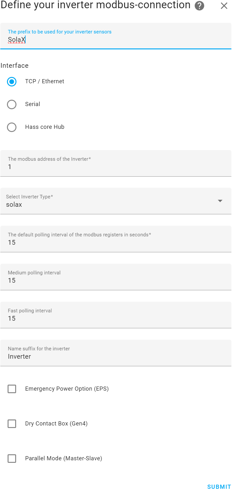
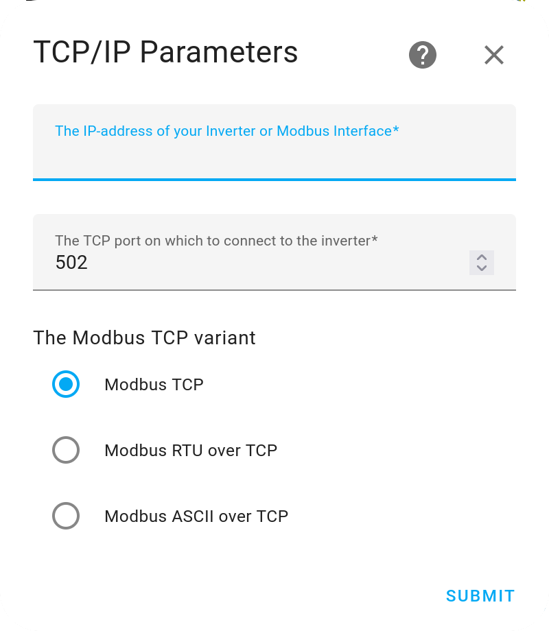

# Installation

Before proceeding, [set up your Modbus adaptor](modbus-adaptor-setup.md) first.

## Installing the integration

### Via HACS - recommended

Use this button to install the integration:

### Manual installation

There should be no need to use this method, but this is how:

- Download the zip / tar.gz source file from the release page.
- Extract the contents of the zip / tar.gz
- In the folder of the extracted content you will find a directory 'custom_components'.
- Copy this directory into your Home-Assistant '<config>' directory so that you end up with this directory structure: '<config>/custom_components/solax_modbus
- Restart Home Assistant Core

## Pair your inverter

Now it's only needed to add your inverter to Home Assistant.
 - a) Click this button:

 - b) if your setup does not support My Home Assistant:
    - Navigate to your `Devices & services`.
    - Click `ADD INTEGRATION`
    - Search and select `SolaX Inverter Modbus`

- You can have multiple instances of this Integration, just change the default Prefix from SolaX to something else. Ie. `SolaX Main` or `SolaX Southwest`.

- Enter correct Modbus address of your inverter - look at your inverter setting, if the default one does not work.
- Select your inverter type.
- Check Emergency Power Option to load entities about EPS.
- Check Dry Contact Box to load entities about Dry Contact.

- Only Sofar and Solinteg take advantage of the different poll speeds. "The default polling interval of the modbus registers in seconds" is the one to reduce from 15 if required. Do not try and poll quicker that 5 s on inverters with a baud of 9600.

- If you use RS485 to Ethernet adaptor:
    - Enter IP address of your adaptor.

- If you use RS485 to USB adaptor:
    - Select the right port.
      - If your installation has a tendancy to swap between ttyUSB0 and ttyUSB1 you can define it by the id
      - /dev/serial/by-id/usb-xyz
    - Enter correct baud rate that does match setting on your inverter.

- If you use Hass core HUB: This assumes you have declared and configured a modbus hub in your configuration.yaml file as described in [this page](https://www.home-assistant.io/integrations/modbus/). The `configuration.yaml` file then describes the connection method (serial, tcp, ..). You may need to declare one dummy entity for this hub.
    - Enter the hub name.

## Potential known problems:

Sometimes after initial installation, some computed entities are missing. An integration reload (or a HA restart) makes these entities show correct data.
We hope to resolve this soon.
