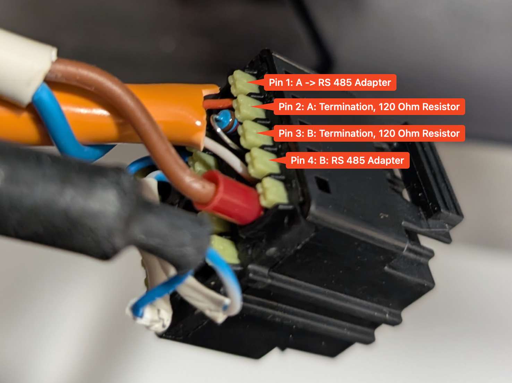
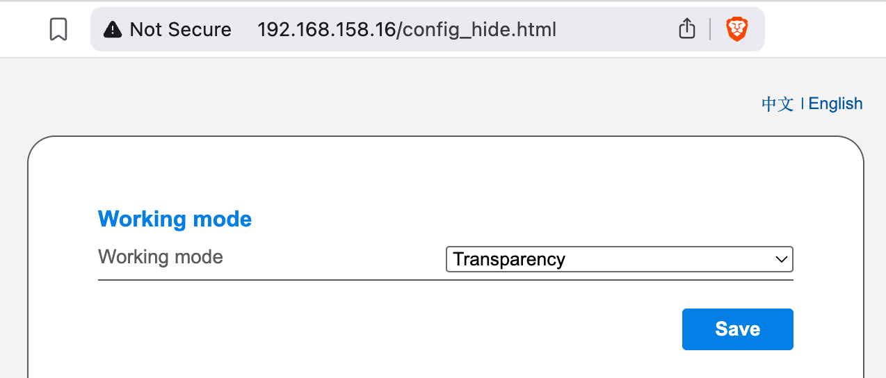

# Sofar Installation

How to establish the connection to your Sofar Solar inverter hardware.

## General recommendation: Use a Modbus Proxy

**Note:** If you use an RS485 to Modbus TCP ethernet adaptor you may ignore this section. Many RS485 to Modbus TCP adaptors have a Modbus proxy built in.

If you experience issues with the reliability of the communication, especially (but not limited to) when you are accessing the Modbus interface with more clients besides Home Assistant at the same time, we recommend to try using a Modbus Proxy. A Modbus Proxy can mediate between the inverter's interface (RS485 serial, Modbus TCP, Modbus TCP over RTU) and multiple clients. You can install a Modbus proxy as a [standalone service](https://github.com/tiagocoutinho/modbus-proxy), you can use the Home Assistant [Modbus Proxy Add-on](https://github.com/Akulatraxas/ha-modbusproxy) or use the embedded Modbus proxy that comes with [EVCC](https://docs.evcc.io/en/docs/reference/configuration/modbusproxy).

Important in this case: Only the Modbus proxy must connect to your inverter directly. All other clients must connect to the proxy.

## Connect an RS485 USB or Ethernet Adaptor

This is a bit more complicated than using the below logger stick configurations, however this is the recommended solution for the following reasons:

- RS-485 is a supported interface from Sofar Solar, while the logger stick alternatives are not supported.
- The communication with the logger sticks proofed to change depending on inverter and logger stick firmware updates. And it's not guaranteed that it will still work after the next update.
- As the logger stick are inofficial interfaces that are not designed, the protocols may not follow the Modbus standards always.
- Does not interfere with the communication to the SolarMan or Sofar Cloud portals.

To install an RS485 Adaptor follow these steps:

1. Shutdown the inverter.
2. Disassemble the COM port connector: Unscrew the rear end from the connector. 
3. Gently push the rubber cap to the back without pulling on the connected wires.
4. Then press the clips on the front of the COM port connector and gently pull out the connector, while gently pushing the other cable from behind. Be careful not to disconnect any of the other wires.
   

5. Recommended cable is an UTP cat.x cable. In the rubber cap you will find three inlets for cables. You might have to pull out one of the cable inlets, that is still protected by a smaller rubber cap.
6. Take a twisted pair, e.g. orange and orange/white, and connect orange to pin 1 (A+), and orange white to pin 4 (B-). Note: Pin 1 and pin 2 are A+ and internally connected with each other in the inverter. The same applies to pin 3 and pin4 for B-.
7. Likely you have just one inverter, so this will be the end point of the RS485 bus. So, you have to install a termination resistor of 120Ohm at this end. Connect this to pins 2 and 3.
   

8. If your RS485 Adaptor provides a GND Input, you can connect it to pin 12. This can improve reliability.
9. Carefully assemble the COM Port connector again in reverse order.
10. Plugin in the COM port connector on the inverter. Now you can verify that everything is connected properly by measuring the resistance on the other side of the cables between A+ and B-. It should measure 120 Ohm.
11. Connect the other sides of the RS485 cable to your adaptor (e.g. orange to A+ and orange/white to B- or whatever combination you have chosen in step 6).
12. Turn on the inverter.
13. Once HomeAssistant and this integration is properly configured and starts to query data you should be able to see an RS485 symbol on the top left. When this symbol is visible RS485 communication is properly established.
   
14. Configure the homeassistant-solax-modbus integration as described on the [installation](installation.md) page. In case you have a serial USB adaptor use 9600 as Baud rate.

## LSW-3 WiFi Stick Logger

The LSW-3 WiFi stick comes with the inverter and **may** be used with this integration directly. Whether it works depends on a number of factors. You can try below methods. If none of these work, revert to RS485.

### Modbus TCP

Tested with firmware:

- Inverter: V121202
- LSW:  LSW3_15_MQTT_270A_1.22 with Extended System Version V1.1.00.04 (you can see this in the Solarman portal under devices on the logger's device data tab. Extended System Version V1.1.00.0F does not work for example).

Simply connect to the LSW using the logger sticks IP address (make sure that you have assigned a fixed IP address in your router) and the port `8899`. If that does not work, try using a Modbus proxy in between as explained above.

Note: This works while the logger stick is using the working mode 'Data collection' and therefore also works in parallel to the SolarMan or Sofar Cloud portal.

### Transparency mode using Modbus RTU over TCP

Tested with firmware:

- Inverter: v113562
- LSW:  LSW3_15_270A_1.09

Does not work with newer firmware.

This has one drawback: You can either use it with the SolarMan portal or with this integration. You can't use it with both at the same time. However once configured, instead of the SolarMan portal you will be able to monitor your inverter with our Home Assistant integration then.

Also note that Modbus RTU over TCP can only talk to one client. You have to use Modbus Proxy, if you access the logger stick with more than one client.

1. In your internet router, find the connected LSW-3 stick logger and assign a fixed IP address to it. You have to do this through your internet router. **Do not assign a fixed IP address in the stick's administration UI directly - this will cause problems**.
2. Open the LSW-3 Web UI at `http://<ip-address>` and login using the default username `admin` and default password `admin`.
3. Open this page in your browser: `http://<ip-address>/config_hide.html`
4. This will open a hidden configuration page with additional configuration options.
5. Under 'Working mode' switch from 'Data collection' to 'transparency'. Note that this will cancel your stick's communication with the SolarMan portal.
   

6. Click on 'Save' and then on 'Restart'.
7. Configure the homeassistant-solax-modbus integration as described on the [installation](installation.md) page.
8. On the first page select `TCP / Ethernet` as interface. Configure the rest as appropriate. Click on 'Submit'.
9. On the page 'TCP/IP Parameters' enter the IP address that you have assigned to the LSW-3 stick in your router. Select '8899' as port and choose 'Modbus RTU over TCP'.
    

## LSE-3 LAN Stick Logger

Tested with firmware:
- Inverter: v113562
- LSE:  LSW3_15_270A_1.09

The LSE-3 LAN stick logger is an alternative to the LSW-3 WiFi stick logger that connects over LAN cable instead of WiFi. 

The default working mode speaks some sort of Modbus TCP with some incompatibilities in parallel to the SolarMan protocol. However this parallel use comes with a couple of caveats as you can see in the [FAQ](./sofar-faq.md) and some reliability issues. **Therefore we do not recommend to run this integration with the LSE-3 in the default 'Data collection' working mode**. We recommend to use the same 'Transparency' working mode as described above for the LSW-3 Wifi stick logger.

However, if you still want to use your LSE-3 LAN logger stick in the default working mode 'Data collection' with this integration nevertheless, here is how to do this:

Once installed and connected to the network using a fixed IP address assigned though your router it provides ModBus TCP out-of-the-box via the port 8899. Just follow the [installation](installation.md) and on the 'TCP/IP Parameters' page enter the IP address of the LSE3 Stick Logger and use 8899 as port and choose 'Modbus TCP'.

Please see the [FAQ](./sofar-faq.md), if you run into issues.

