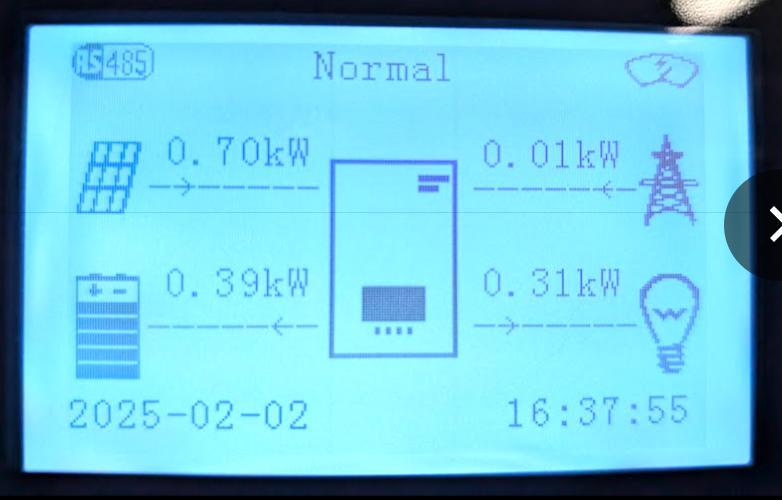

# Sofar Installation

How to install the RS485 connection to your Sofar Solar inverter hardware.

## LSE3 Stick Logger

The easiest installation is by replacing the LSW3 WiFi Stick Logger that comes with the inverter with the LSE3 Ethernet Stick Logger. You just need to replace the stick, plugin the Ethernet cable and you are ready to go. However it comes with a couple of caveats as you can see in the [FAQ](./sofar-faq.md).

Once installed and connected to the network it provides ModBus TCP out-of-the-box via the port 8899. Just follow the [installation](installation.md) and on the 'TCP/IP Parameters' page enter the IP address of the LSE3 Stick Logger and use 8899 as port.

Please see the [FAQ](./sofar-faq.md), if you run into issues.

## Connect an RS485 USB or Ethernet Adaptor

This is a bit more complicated, however the recommended solution.

1. Shutdown the inverter.
2. Disassemble the COM port connector: Unscrew the rear end from the connector. 
3. Gently push the rubber cap to the back without pulling on the connected wires.
4. Then press the clips on the front of the COM port connector and gently pull out the connector, while gently pushing the other cable from behind. Be careful not to disconnect any of the other wires.
   

5. Recommended cable is an UTP cat.x cable. In the rubber cap you will find three inlets for cables. You might have to pull out one of the cable inlets, that is still protected by a smaller rubber cap.
6. Take a twisted pair, e.g. orange and orange/white, and connect orange to pin 1 (A+), and orange white to pin 4 (B-). Note: Pin 1 and pin 2 are A+ and internally connected with each other in the inverter. The same applies to pin 3 and pin4 for B-.
7. Likely you have just one inverter, so this will be the end point of the RS485 bus. So, you have to install a termination resistor of 120Ohm at this end. Connect this to pins 2 and 3.
   

8. If your RS485 Adaptor provides a GND Input, you can connect it to pin 12. This can improve reliability.
9. Carefully assemble the COM Port connector again in reverse order.
10. Plugin in the COM port connector on the inverter. Now you can verify that everything is connected properly by measuring the resistance on the other side of the cables between A+ and B-. It should measure 120 Ohm.
11. Connect the other sides of the RS485 cable to your adaptor (e.g. orange to A+ and orange/white to B- or whatever combination you have chosen in step 6).
12. Turn on the inverter.
13. Once HomeAssistant and this integration is properly configured and starts to query data you should be able to see an RS485 symbol on the top left. When this symbol is visible RS485 communication is properly established.
   