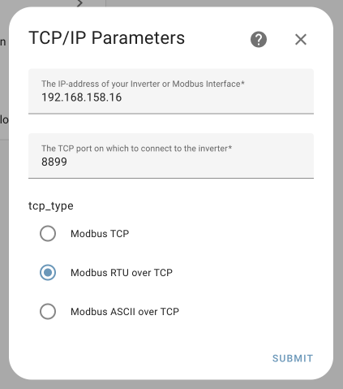

# Sofar Installation

How to install the RS485 connection to your Sofar Solar inverter hardware.

## LSW-3 WiFi Stick Logger

The LSW-3 WiFi stick comes with the inverter and can be used with this integration directly. However there is one drawback: You can either use it with the SolarMan portal or with this integration. You can't use it with both at the same time.

But once configured, instead of the SolarMan portal you will be able to monitor your inverter with our Home Assistant integration then.

### Configuration

1. In your internet router, find the connected LSW-3 stick logger and assign a fixed IP address to it. You have to do this through your internet router. **Do not assign a fixed IP address in the stick's administration UI directly - this will cause problems**.
2. Open the LSW-3 Web UI at `http://<ip-address>` and login using the default username `admin` and default password `admin`.
3. Open this page in your browser: `http://<ip-address>/config_hide.html`
4. This will open a hidden configuration page with additional configuration options.
5. Under 'Working mode' switch from 'Data collection' to 'transparency'. Note that this will cancel your stick's communication with the SolarMan portal.
   

6. Click on 'Save' and then on 'Restart'.
7. Configure the homeassistant-solax-modbus integration as described on the [installation](installation.md) page.
8. On the first page select `TCP / Ethernet` as interface. Configure the rest as appropriate. Click on 'Submit'.
9. On the page 'TCP/IP Parameters' enter the IP address that you have assigned to the LSW-3 stick in your router. Select '8899' as port and choose 'Modbus RTU over TCP'.
    

## LSE-3 LAN Stick Logger

The LSE-3 LAN stick logger is an alternative to the LSW-3 WiFi stick logger that connects over LAN cable instead of WiFi. 

In contrast to the LSW-3 you can also use it with SolarMan and this integration in parallel at the same time. The default working mode speaks some sort of Modbus TCP with some incompatibilities besides its SolarMan protocol. However this parallel use comes with a couple of caveats as you can see in the [FAQ](./sofar-faq.md) and some reliability issues. **Therefore we do not recommend to run this integration with the LSE-3 in the default 'Data collection' working mode**. We recommend to use the same 'Transparency' working mode as described above for the LSW-3 Wifi stick logger.

However, if you still want to use your LSE-3 LAN logger stick in the default working mode 'Data collection' with this integration nevertheless, here is how to do this:

Once installed and connected to the network using a fixed IP address assigned though your router it provides ModBus TCP out-of-the-box via the port 8899. Just follow the [installation](installation.md) and on the 'TCP/IP Parameters' page enter the IP address of the LSE3 Stick Logger and use 8899 as port and choose 'Modbus TCP'.

Please see the [FAQ](./sofar-faq.md), if you run into issues.

## Connect an RS485 USB or Ethernet Adaptor

This is a bit more complicated, however the recommended solution, if you want to keep your logger stick connected to the SolarMan portal, while also being able to use this integration at the same time.

1. Shutdown the inverter.
2. Disassemble the COM port connector: Unscrew the rear end from the connector. 
3. Gently push the rubber cap to the back without pulling on the connected wires.
4. Then press the clips on the front of the COM port connector and gently pull out the connector, while gently pushing the other cable from behind. Be careful not to disconnect any of the other wires.
   

5. Recommended cable is an UTP cat.x cable. In the rubber cap you will find three inlets for cables. You might have to pull out one of the cable inlets, that is still protected by a smaller rubber cap.
6. Take a twisted pair, e.g. orange and orange/white, and connect orange to pin 1 (A+), and orange white to pin 4 (B-). Note: Pin 1 and pin 2 are A+ and internally connected with each other in the inverter. The same applies to pin 3 and pin4 for B-.
7. Likely you have just one inverter, so this will be the end point of the RS485 bus. So, you have to install a termination resistor of 120Ohm at this end. Connect this to pins 2 and 3.
   

8. If your RS485 Adaptor provides a GND Input, you can connect it to pin 12. This can improve reliability.
9. Carefully assemble the COM Port connector again in reverse order.
10. Plugin in the COM port connector on the inverter. Now you can verify that everything is connected properly by measuring the resistance on the other side of the cables between A+ and B-. It should measure 120 Ohm.
11. Connect the other sides of the RS485 cable to your adaptor (e.g. orange to A+ and orange/white to B- or whatever combination you have chosen in step 6).
12. Turn on the inverter.
13. Once HomeAssistant and this integration is properly configured and starts to query data you should be able to see an RS485 symbol on the top left. When this symbol is visible RS485 communication is properly established.
   