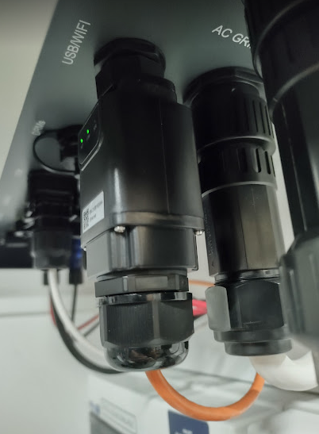

# Sofar Solar Installation

How to install the RS485 connection to your Sofar Solar inverter hardware.

## LSE3 Stick Logger - Recommended

Most reliable and most easy installation is by replacing the LSW3 WiFi Stick Logger that comes with the inverter with the LSE3 Ethernet Stick Logger.

Once installed and connected to the network it provides ModBus TCP out-of-the-box via the port 8899. Just follow the [installation](installation.md) and on the TCP/IP Parameters page enter the IP address of the LSE3 Stick Logger and use 8899 as port.

## Connect an RS485 USB or Ethernet Adapter

1. Shutdown the inverter.
2. Disassemble the COM Port connector: 
   1. Unscrew the rear end from the connector. 
   2. Gently push the rubber cab to the back without pulling on the connectors.
   3. Then press the clips on the front and gently pull out the connector, while gently pushing the other cable from behind. Be careful not to disconnect any of the other wires.

3. Recommended cable is an UTP cat.x cable. In the rubber cap you there are three inlets for cables. You might have to pull out on of the inlets, that is still protected by a smaller rubber cap.
4. Take a twisted pair, e.g. orange, and connect one to PIN 1 (A), e.g. orange solid, and the other to PIN 3 (B), e.g. orange/white. Alternatively you can use PINs 2 and 4.

5. If your RS485 Adapter provides a GND Input, you can connect it to pin 12.
6. Carefully assemble the COM Port connector again in reverse order.
7. Connect the other sides of the RS485 cable to your adaptor.
8. Turn on the inverter.
9. After a while you should be able to see an RS485 symbol on the top left. When this symbol is visible RS485 communication is established.